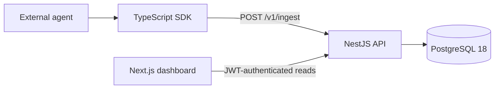

# AgentPulse

AgentPulse is a multi-tenant observability platform for AI agents. It captures
complete agent executions as traces, records nested LLM/tool/retrieval work as
spans, and makes status, latency, tokens, cost, errors, and input/output context
understandable in a web dashboard.

## V1 architecture



One `traces` row is one complete agent execution. Nested operations live in
`spans`; V1 intentionally has no separate `agent_runs` table or queue layer.
See [architecture.md](docs/architecture.md) and the canonical
[database schema](docs/database-schema.md).

## Repository

```text
apps/web/             Next.js dashboard and server-side API proxy
apps/api/             NestJS API, Prisma schema, and migrations
packages/shared/      Shared telemetry contracts and validation
packages/sdk/         Manual-instrumentation TypeScript SDK
examples/demo-agent/  Deterministic success/failure demo workload
examples/support-rag-agent/  Realistic SDK-only support RAG workflow
deploy/               Production Compose configuration
docs/                 Architecture, schema, deployment, and demo guides
```

## Local setup

Prerequisites: Node.js 24, pnpm 11.22.0, and PostgreSQL 18.

```powershell
pnpm install --frozen-lockfile
Copy-Item apps/api/.env.example apps/api/.env
Copy-Item apps/web/.env.example apps/web/.env.local
```

Set the ignored API environment file to your local PostgreSQL URL and two
different high-entropy JWT secrets. Then apply migrations and start the apps:

```powershell
pnpm --filter api db:migrate:deploy
pnpm dev
```

Open `http://localhost:3000`. The API listens on `http://localhost:5000` by
default. Create an account, organization, project, and project API key from the
web app.

## Environment variables

- API: `DATABASE_URL`, `JWT_ACCESS_SECRET`, `JWT_REFRESH_SECRET`, `PORT`, and
  `CORS_ORIGINS`.
- Web: server-only `AGENTPULSE_API_URL`.
- Demo: `AGENTPULSE_API_KEY` and `AGENTPULSE_BASE_URL`.

Examples contain placeholders only. `.env` files are ignored and must never be
committed. See [deployment.md](docs/deployment.md) for the production variable
matrix and migration sequence.

## SDK usage

The V1 SDK is consumed as a workspace package. From a TypeScript agent package
in this monorepo, add it and then keep the project key in server-side
environment configuration:

```powershell
pnpm add @agentpulse/sdk@workspace:*
```

```dotenv
AGENTPULSE_API_KEY=<your-project-api-key>
AGENTPULSE_BASE_URL=http://127.0.0.1:5000
```

```ts
import { AgentPulse } from "@agentpulse/sdk";

const pulse = new AgentPulse(
  process.env.AGENTPULSE_API_KEY!,
  process.env.AGENTPULSE_BASE_URL!,
);

const trace = pulse.startTrace({
  name: "answer-question",
  agentName: "support-agent",
});
const retrieval = pulse.startSpan(trace, {
  type: "retrieval",
  name: "search-docs",
});
pulse.endSpan(retrieval, {
  status: "success",
  latencyMs: 85,
  output: { matches: 3 },
});
await pulse.endTrace(trace, {
  status: "success",
  inputTokens: 400,
  outputTokens: 20,
  totalCost: "0.00180000",
});
```

The SDK sends the completed trace through `POST /v1/ingest` with
`Authorization: Bearer <project-api-key>`. It never logs or embeds the key in
errors. The raw key is shown once in the dashboard; store it in a secret manager.

## Demo and verification

Set `AGENTPULSE_API_KEY`, then run:

```powershell
pnpm demo
```

The deterministic demo emits successful and failed nested traces without an
external AI provider. Follow the [reviewer demo](docs/demo.md) to verify the
database-to-dashboard flow and capture safe screenshots.

For a realistic one-invocation/one-trace workflow with retrieval, tool, and LLM
spans, see the [support RAG agent](examples/support-rag-agent/README.md).

Repository checks:

```powershell
pnpm lint
pnpm build
pnpm test
pnpm --filter api test:e2e -- --runInBand
```

## Deployment

AgentPulse supports ordinary Node.js services or the included single-host
Docker Compose stack with Caddy TLS, private application networks, PostgreSQL
18, health-gated startup, and a one-shot `prisma migrate deploy` release step.
Keep all credentials in an ignored deployment env file or a secret manager.

See [deployment.md](docs/deployment.md) for managed-platform and self-hosted
instructions. A live deployment still requires a Linux host, two DNS records,
deployment secrets, and production backup/operations ownership.
