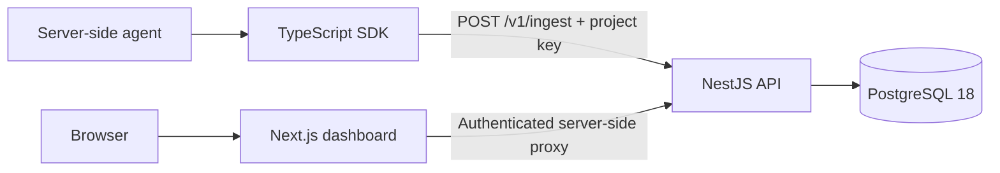

# AgentPulse

AgentPulse is a multi-tenant observability platform for AI agents. A complete
agent execution is recorded as a trace; nested agent, retrieval, tool, LLM, and
custom operations are recorded as spans. The dashboard makes status, latency,
tokens, estimated cost, captured input/output, and failures inspectable by
project.

## Start here

- **Reviewer or interviewer:** run the repeatable
  [support-RAG product demo](docs/demo.md) and inspect both a successful and a
  failed agent execution.
- **New developer:** follow [Getting started](docs/getting-started.md) to run
  AgentPulse locally, create a project key, and send a first trace.
- **Example source:** read the realistic, deterministic
  [support-RAG agent](examples/support-rag-agent/README.md).
- **Production:** use the [deployment guide](docs/deployment.md) for managed
  services or the included Docker Compose stack.

## Architecture



The SDK sends one completed trace and its spans in a single authenticated
ingest request. The API resolves the project from the API key, validates the
shared telemetry contract, and writes to PostgreSQL. Dashboard reads are
tenant-scoped. The current V1 does not require Redis, BullMQ, or a separate
worker service.

See [Architecture](docs/architecture.md) for the implemented components and
data flows. The Prisma schema and migrations under `apps/api/prisma/` are the
source of truth for persistence.

## Implemented product surface

- Project-scoped ingestion keys with one-time plaintext visibility, digest
  storage, expiry support, usage tracking, and revocation.
- A manual TypeScript SDK for nested agent, retrieval, tool, LLM, and custom
  spans with status, timing, tokens, estimated cost, input/output, and errors.
- Validated, transactional `POST /v1/ingest` persistence with tenant isolation
  and idempotent trace/span upserts.
- A responsive runs dashboard with aggregate metrics, filters, pagination,
  realtime refresh, and nested trace/span timelines.
- Failed-trace root-cause analysis from captured operational evidence, with a
  local fallback and an optional OpenAI-compatible provider.
- Error-rate, latency, and cost alert-rule APIs, persisted alert events in the
  dashboard, and optional HTTPS webhook delivery.

The bundled support-RAG example uses synthetic local data and deterministic
timings, token counts, and estimated costs. It demonstrates observability
without claiming production traffic or calling a paid AI provider.

## Five-minute product demo

After completing local setup and creating a project key, run both support-RAG
paths from the repository root:

```powershell
$env:AGENTPULSE_API_KEY = "<your-project-api-key>"
$env:AGENTPULSE_BASE_URL = "http://127.0.0.1:5000"
pnpm --filter @agentpulse/support-rag-agent-example start
pnpm --filter @agentpulse/support-rag-agent-example start -- --simulate-failure
```

Then open **Runs** to compare the successful retrieval/tool/LLM trace with the
failed tool trace, inspect their span trees and telemetry, and run the
evidence-based RCA on the failure. The complete
[reviewer walkthrough](docs/demo.md) lists the exact expected evidence and an
optional alert-rule demonstration.

## Repository

```text
apps/web/                     Next.js dashboard and server-side API proxy
apps/api/                     NestJS API, Prisma schema, and migrations
packages/shared/              Telemetry contracts and validation
packages/sdk/                 Manual-instrumentation TypeScript SDK
examples/demo-agent/          Deterministic success/failure demo
examples/support-rag-agent/   Realistic support RAG instrumentation example
deploy/                       Production Compose and Caddy configuration
docs/                         Developer, architecture, demo, and deployment docs
```

## Local development

Prerequisites: Node.js 24, pnpm 11.22.0, and a running PostgreSQL 18 database.

From the repository root in PowerShell:

```powershell
pnpm install --frozen-lockfile
Copy-Item apps/api/.env.example apps/api/.env
Copy-Item apps/web/.env.example apps/web/.env.local
```

In `apps/api/.env`, replace `DATABASE_URL` with a reachable local database URL
and set different high-entropy values of at least 32 bytes for
`JWT_ACCESS_SECRET` and `JWT_REFRESH_SECRET`. The defaults expect the web app at
`http://localhost:3000` and the API at `http://localhost:5000`.

Apply the checked-in migrations, then start both applications:

```powershell
pnpm --filter api db:migrate:deploy
pnpm dev
```

Open `http://localhost:3000`, create an account, organization, project, and
project API key. The plaintext key is shown once; save it immediately. Continue
with the [SDK quickstart](docs/getting-started.md#typescript-sdk-quickstart).

## SDK at a glance

Install the SDK in your server-side Node.js application:

```powershell
pnpm add @agentpulse/sdk
```

```ts
import { AgentPulse } from "@agentpulse/sdk";

async function main() {
  const pulse = new AgentPulse(
    process.env.AGENTPULSE_API_KEY!,
    process.env.AGENTPULSE_BASE_URL ?? "http://127.0.0.1:5000",
  );

  const trace = pulse.startTrace({
    agentName: "support-agent",
    name: "answer-question",
  });
  const span = pulse.startSpan(trace, {
    type: "llm_call",
    name: "generate-answer",
    input: { question: "How do I rotate a project key?" },
  });

  pulse.endSpan(span, {
    output: {
      answer: "Create a replacement, verify it, then revoke the old key.",
    },
    inputTokens: 120,
    outputTokens: 24,
    estimatedCost: "0.0012",
  });

  await pulse.endTrace(trace);
}

void main();
```

`endTrace()` validates and sends the trace to `POST /v1/ingest` with the project
key in `Authorization: Bearer …`. Read [Getting started](docs/getting-started.md)
for nested spans, failure instrumentation, the ingest contract, security, and
troubleshooting.

## Documentation

| Guide                                                       | Use it for                                                                            |
| ----------------------------------------------------------- | ------------------------------------------------------------------------------------- |
| [Getting started](docs/getting-started.md)                  | Local setup, project keys, SDK instrumentation, ingest reference, and troubleshooting |
| [Architecture](docs/architecture.md)                        | Implemented services, trust boundaries, storage, alerts, realtime updates, and RCA    |
| [Support RAG example](examples/support-rag-agent/README.md) | A runnable success/failure integration with nested spans                              |
| [Reviewer demo](docs/demo.md)                               | Deterministic end-to-end dashboard verification                                       |
| [Deployment](docs/deployment.md)                            | Production variables, migrations, health checks, Compose, TLS, and operations         |
| [Database design background](docs/database-schema.md)       | Historical Month 1 schema rationale; Prisma is authoritative for the current schema   |

## Repository checks

```powershell
pnpm lint
pnpm build
pnpm test
pnpm --filter api test:e2e -- --runInBand
```

The API end-to-end suite requires a reachable test PostgreSQL database through
`DATABASE_URL`. Individual SDK and example checks are listed in
[Getting started](docs/getting-started.md#verify-the-integration).

## Security baseline

- Keep project API keys in server-side environment variables or a secret
  manager; never ship them to browser code or commit them.
- AgentPulse stores only a key digest and display prefix. The raw key cannot be
  recovered after its one-time creation response.
- Treat trace/span input, output, metadata, attributes, error messages, and
  stacks as potentially sensitive telemetry. Capture only what your policy
  permits.
- Use HTTPS API origins outside local development and follow the
  [deployment guide](docs/deployment.md) for production secrets and networking.
