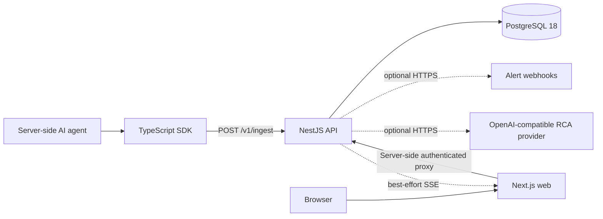

# AgentPulse architecture

This document describes the implemented V1 architecture. The codebase is the
source of truth; planned distributed components are intentionally excluded.

## System overview



AgentPulse runs as two Node.js services plus PostgreSQL:

- `apps/web`: authentication UI, workspace/project selection, project API-key
  management, run metrics and filters, alert events, and trace/span detail.
- `apps/api`: authentication, tenant authorization, API keys, ingestion, trace
  reads and aggregates, alert evaluation/delivery, realtime events, and failed
  trace root-cause analysis.
- `packages/shared`: the runtime-validated trace/span telemetry contract.
- `packages/sdk`: manual TypeScript instrumentation and ingestion client.
- PostgreSQL: the durable source of truth.

Redis, BullMQ, and a separate worker service are not required by the current
implementation.

## Core data model

An organization contains projects and memberships. Each project owns API keys,
traces, alert rules, and alert events.

One trace represents one complete agent execution (also called a run in the
dashboard). A trace contains zero or more spans. There is no separate
`agent_runs` table.

Supported span types are:

- `agent`
- `retrieval`
- `tool_call`
- `llm_call`
- `custom`

`parentSpanId` forms the span tree within a trace. Trace and span status values
are `running`, `success`, or `failed`; the current SDK sends completed traces
as `success` or `failed`.

The implemented Prisma schema and checked-in migrations under
[`apps/api/prisma/`](../apps/api/prisma/) are authoritative. The
[Month 1 database design](database-schema.md) remains background rationale, not
an operational schema or migration source.

## Telemetry ingestion flow

```text
Agent code
  -> AgentPulse.startTrace/startSpan/endSpan/endTrace
  -> POST /v1/ingest with Authorization: Bearer <project key>
  -> API-key authentication and per-key/project rate limiting
  -> shared contract validation
  -> transactional trace/span upsert in PostgreSQL
  -> 202 { traceId, spansProcessed }
```

The API derives the project from the API key and rejects a client-supplied
`projectId`. Reusing a trace and span ID in the same project/trace is
idempotent. An ID already owned by another project or trace returns a conflict.

After the transaction commits, the API publishes a best-effort in-process
`telemetry.ingested` event and enqueues alert evaluation in a
concurrency-limited in-process post-ingest queue. PostgreSQL remains
authoritative if realtime delivery or post-ingest processing is unavailable.

See [Getting started](getting-started.md) for the SDK and ingest contract.

## Dashboard and authentication flow

The browser talks to Next.js Route Handlers rather than directly storing API
access tokens. The web service proxies authenticated requests to the NestJS API
and keeps access/refresh tokens in HttpOnly cookies.

The API enforces organization membership and project-scoped authorization on
workspace, project, key, trace, alert, and RCA reads. A project key
authenticates only telemetry ingestion; it is not a dashboard session
credential.

Dashboard screens query PostgreSQL-backed API endpoints for their initial and
recovery state. Project-scoped Server-Sent Events notify the dashboard about
new telemetry and alert events, but the UI continues to work through ordinary
reads when the stream reconnects.

## API keys and trust boundaries

Project API keys are high-entropy bearer credentials. At creation, the API
returns the raw key once. PostgreSQL stores its SHA-256 digest, display prefix,
usage timestamp, optional expiry, and optional revocation timestamp.

The SDK is intended for server-side agent code. Keys must not be embedded in a
browser bundle, committed, logged, or included in captured telemetry. The API
never uses a client-provided project identifier to route ingestion.

Captured input, output, metadata, attributes, error messages, and stacks are
application-provided telemetry and may contain sensitive data. Integrators are
responsible for redaction and data-minimization before instrumentation.

## Metrics, alerts, and realtime events

Run metrics are PostgreSQL aggregates over project traces: total/success/failed
counts, success/error rates, average completed-run latency, token totals, and
estimated cost.

Enabled alert rules are evaluated from persisted completed traces in the
five-minute window ending at the ingested trace's start time. Supported rule
types are error rate, average latency, and total cost. Triggered events are
persisted before optional webhook delivery. Delivery configuration maps project
IDs to HTTPS URLs through `ALERT_WEBHOOK_URLS_JSON`.

The in-process SSE channel publishes `telemetry.ingested` and
`alert.triggered`; it also sends heartbeats. It is a dashboard optimization,
not a durable event bus.

## Root-cause analysis

RCA is available only for failed traces. The API constructs evidence from
trace/span status, latency, provider/model, and error fields. Captured span
input and output are not sent to the RCA provider.

When `RCA_PROVIDER_API_KEY` and `RCA_PROVIDER_MODEL` are configured, the API
calls an OpenAI-compatible chat-completions endpoint at
`RCA_PROVIDER_BASE_URL`. Without a configured provider, or if the provider
fails, the API returns a local evidence-based explanation.

## Deployment topology

The included production Compose stack runs Caddy, web, API, PostgreSQL, and a
one-shot migration container. Only Caddy publishes host ports. Managed
platforms can deploy the two Node.js services and PostgreSQL separately.

See [Deployment](deployment.md) for the exact environment matrix, migration
order, health probes, TLS, and operational requirements.
